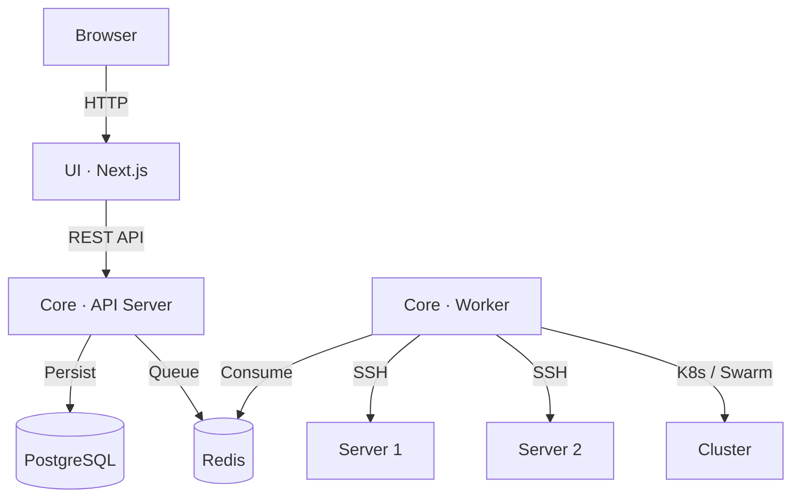

# Orchestra


> **Orchestra** is an internal PaaS for managing physical servers. It eliminates "snowflake servers" by automating provisioning, cluster orchestration, and application deployment on bare metal.

## Features

- **Multi-Runtime Clusters** — Kubernetes (K3s), Docker Swarm, or plain Docker
- **Server Inventory** — Auto-discovery and pre-flight checks (CPU, RAM, OS, Cgroups) via SSH
- **Cluster Designer** — Visual UI to designate manager/worker nodes and form clusters
- **Application Deployment** — Deploy from Git repos, Docker images, or manual paths
- **Environment Management** — Scoped env vars (production/staging/preview) pushed to servers
- **Nginx Provisioning** — Automatic reverse proxy + Let's Encrypt SSL setup
- **Zero-Agent Architecture** — Uses `crypto/ssh`; no permanent agent on nodes

## Architecture

```
Orchestra/
├── core/           # Go — API server, background worker, provisioning engine
├── ui/             # Next.js — Dashboard, cluster designer, deploy wizard
└── docker-compose.yml
```



## Quick Start

### Prerequisites
- Docker & Docker Compose v2
- `make` (optional)

### Run

```bash
git clone https://github.com/enochcodes/orchestra.git
cd orchestra

# Start the full stack (PostgreSQL, Redis, Core, Worker, UI)
make up
# OR
docker compose up -d
```

**Access the dashboard:** [http://localhost:3000](http://localhost:3000)

| Service    | URL / Address |
|------------|---------------|
| UI         | `http://localhost:3000` |
| API        | `http://localhost:8080` |
| PostgreSQL | `localhost:5432` |
| Redis      | `localhost:6379` |

**Default login** (seeded on first run):
- Email: `admin@orchestra.local`
- Password: `admin123`

**Stop:**

```bash
make down        # Stop containers
make clean       # Stop + remove volumes
```

### Production

Create a `.env` file:

```env
ENCRYPTION_KEY=<64-hex-chars>   # openssl rand -hex 32
JWT_SECRET=<your-secret>
SKIP_AUTH=false
```

## Development

### Core (Go)

```bash
make dev-deps                    # Start DB + Redis only
cd core
cp .env.example .env             # Set ENCRYPTION_KEY
go run cmd/server/main.go        # API server
go run cmd/worker/main.go        # Background worker
```

### UI (Next.js)

```bash
cd ui
cp .env.example .env
npm install
npm run dev
```

### E2E Testing (Playwright)

```bash
cd ui
npx playwright install
npm run test:e2e
```

## Contributing

See [CONTRIBUTING.md](CONTRIBUTING.md).

## License

MIT — see [LICENSE](LICENSE).
